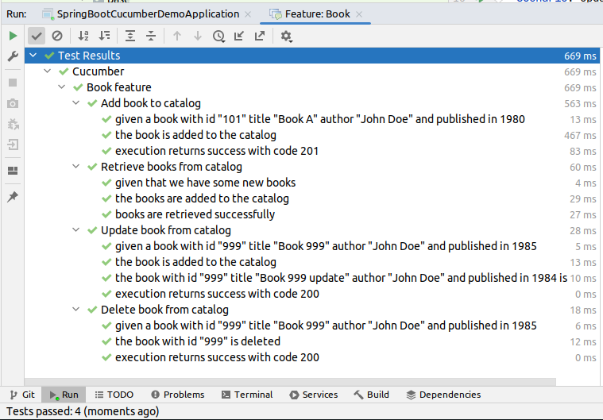
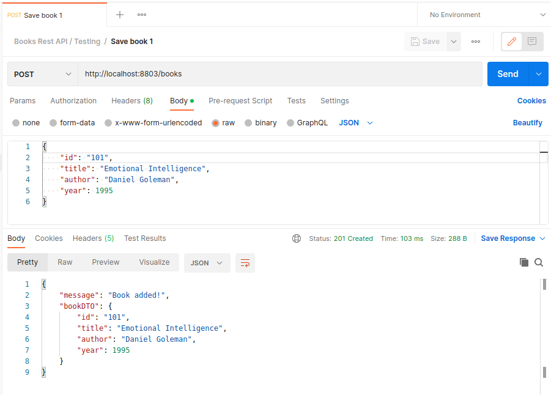
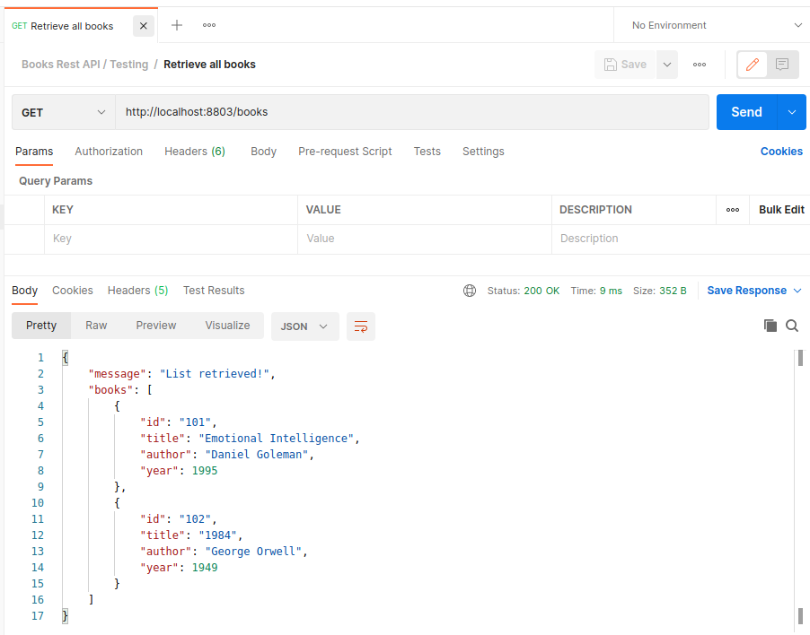
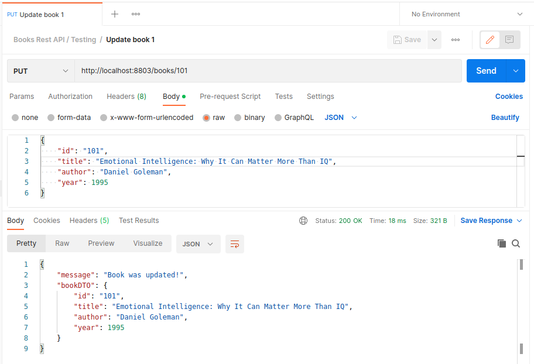
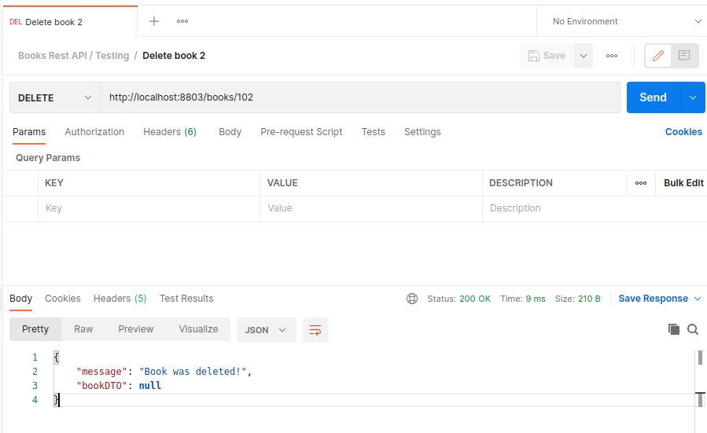
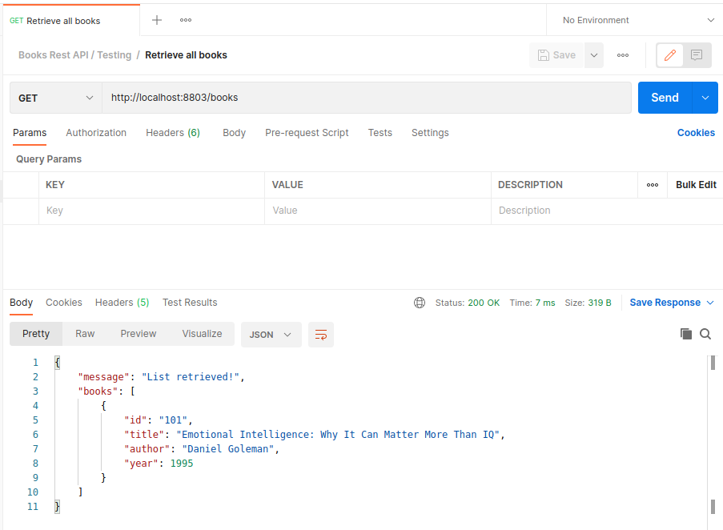

CUCUMBER DEMO
-----------------------------------------------------------------

Behaviour driven development with Spring Boot and Cucumber.

A few Cucumber examples are created to test Rest endpoints.



-----------------------------------------------------------------

**Dependencies added to pom.xml file**

```

    <dependency>
        <groupId>io.cucumber</groupId>
        <artifactId>cucumber-java</artifactId>
        <version>${cucumber.version}</version>
        <scope>test</scope>
    </dependency>
    
    <dependency>
        <groupId>io.cucumber</groupId>
        <artifactId>cucumber-junit</artifactId>
        <version>${cucumber.version}</version>
        <scope>test</scope>
    </dependency>
    
    <dependency>
        <groupId>io.cucumber</groupId>
        <artifactId>cucumber-spring</artifactId>
        <version>${cucumber.version}</version>
        <scope>test</scope>
    </dependency>

```
-----------------------------------------------------------------

**Cucumber configuration**

In this configuration class we can tell where to find the Cucumber features 
files and where the glue classes are located (steps):

```

    @RunWith(Cucumber.class)
    @CucumberOptions(
            features = {"src/test/resources/features"},
            plugin = {"pretty"},
            glue = {"com.example.demo.cucumber.base", "com.example.demo.cucumber.steps"})
    public class CucumberRunner {
    
    }

```

-----------------------------------------------------------------

**Book.feature** is located in the directory **src/test/resources/features**
and contains the cucumber tests related to the **class BookController.java**

```

    Feature: Book feature
    
        Scenario: Add book to catalog
        Given given a book with id "101" title "Book A" author "John Doe" and published in 1980
        When  the book is added to the catalog
        Then  execution returns success with code 201


        Scenario: Retrieve books from catalog
        Given given that we have some new books
        When  the books are added to the catalog
        Then  books are retrieved successfully


        Scenario: Update book from catalog
        Given given a book with id "999" title "Book 999" author "John Doe" and published in 1985
        When the book is added to the catalog
        And the book with id "999" title "Book 999 update" author "John Doe" and published in 1984 is updated
        Then execution returns success with code 200


        Scenario: Delete book from catalog
        Given given a book with id "999" title "Book 999" author "John Doe" and published in 1985
        When the book with id "999" is deleted
        Then execution returns success with code 200

```

-----------------------------------------------------------------

The feature file executes the logic in the class **BookSteps.java**,
which is located in the directory **src/test/com/example/demo**.

```

public class BookSteps extends TestBase {

    private BookDTO bookDTO;
    private List<BookDTO> bookList;
    private ResponseEntity<BookResponse> bookResponse;

    @Given("^given a book with id \"([^\"]*)\" title \"([^\"]*)\" author \"([^\"]*)\" and published in (\\d+)$")
    public void given_a_new_book(String id, String title, String author, int year) throws Throwable {
        log.info("Given a new book with id: " + id);

        bookDTO = new BookDTO();
        bookDTO.setId(id);
        bookDTO.setTitle(title);
        bookDTO.setAuthor(author);
        bookDTO.setYear(year);
    }

    @Given("^that we have some new books$")
    public void given_some_new_books() throws Throwable {
        log.info("Given some new books...");

        bookList = new ArrayList<>();

        BookDTO bookDTO = new BookDTO();
        bookDTO.setId("1001");
        bookDTO.setTitle("Book 1001");
        bookDTO.setAuthor("author");
        bookDTO.setYear(1991);

        bookList.add(bookDTO);

        bookDTO = new BookDTO();
        bookDTO.setId("1002");
        bookDTO.setTitle("Book 1002");
        bookDTO.setAuthor("author");
        bookDTO.setYear(1992);

        bookList.add(bookDTO);

        bookDTO = new BookDTO();
        bookDTO.setId("1003");
        bookDTO.setTitle("Book 1003");
        bookDTO.setAuthor("author");
        bookDTO.setYear(1993);

        bookList.add(bookDTO);

    }

    @When("^the book is added to the catalog$")
    public void a_book_is_added() {
        String urlAddBook = baseUrl;
        log.info("A book is added calling url: " + urlAddBook);

        HttpEntity<BookDTO> entity = new HttpEntity<>(bookDTO, null);
        this.bookResponse = restTemplate.exchange(urlAddBook, HttpMethod.POST, entity, BookResponse.class);
    }

    @When("^the books are added to the catalog$")
    public void books_are_added() {
        log.info("Books are added...");

        String urlAddBook = baseUrl;

        if (bookList != null && bookList.size() > 0) {
            log.info("Books size: " + bookList.size());

            for (BookDTO book: bookList) {
                HttpEntity<BookDTO> entity = new HttpEntity<>(book, headers);
                ResponseEntity<BookResponse> bookResponse = restTemplate.exchange(urlAddBook, HttpMethod.POST, entity, BookResponse.class);

                log.info("book added response status: " + bookResponse.getStatusCode().value());
                if (bookResponse.getStatusCodeValue() != HttpStatus.CREATED.value()) {
                    fail();
                }
                log.info("book id: " + bookResponse.getBody().getBookDTO().getId());
            }
        }
        else {
            fail();
        }

    }

    @When("^the book with id \"([^\"]*)\" title \"([^\"]*)\" author \"([^\"]*)\" and published in (\\d+) is updated$")
    public void update_book(String id, String title, String author, int year) throws Throwable {
        log.info("Update book with id : " + id);

        bookDTO = new BookDTO();
        bookDTO.setId(id);
        bookDTO.setTitle(title);
        bookDTO.setAuthor(author);
        bookDTO.setYear(year);

        String urlGetBook = baseUrl + "/" + bookDTO.getId();
        seCreaHeader();

        HttpEntity<BookDTO> entity = new HttpEntity<>(bookDTO, headers);
        this.bookResponse = restTemplate.exchange(urlGetBook, HttpMethod.PUT, entity, BookResponse.class);
    }

    @When("^the book with id \"([^\"]*)\" is deleted$")
    public void delete_book(String id) throws Throwable {
        log.info("Delete book with id : " + id);

        String urlGetBook = baseUrl + "/" + id;
        seCreaHeader();

        HttpEntity<BookDTO> entity = new HttpEntity<>(null, headers);
        this.bookResponse = restTemplate.exchange(urlGetBook, HttpMethod.DELETE, entity, BookResponse.class);
    }

    @Then("^execution returns success with code (\\d+)$")
    public void execution_returns_code(int httpCode) {
        log.info("Execution returns with code : " + httpCode);

        if (bookResponse != null) {
            assertThat(bookResponse.getStatusCodeValue()).isEqualTo(httpCode);
        } else {
            fail();
        }
    }

    @Then("^books are retrieved successfully$")
    public void books_retrieved_successfully() throws Throwable {
        log.info("Books retrieved succesfully...");

        seCreaHeader();

        if (bookList != null && bookList.size() > 0) {
            for (BookDTO book: bookList) {
                String urlGetBook = baseUrl + "/" + book.getId();
                HttpEntity entity = new HttpEntity<>(null, headers);
                ResponseEntity<BookResponse> bookResponse = restTemplate.exchange(urlGetBook, HttpMethod.GET, entity, BookResponse.class);
                log.info("bookResponse status: " + bookResponse.getStatusCode().value());

                if (bookResponse == null || bookResponse.getStatusCodeValue() != 200 ) {
                    fail();
                }
                else {
                    log.info("Get book success...");
                    assertThat(bookResponse.getBody() != null);
                    assertThat(bookResponse.getBody().getBookDTO() != null);
                    assertThat(bookResponse.getBody().getBookDTO().getId() == book.getId());
                }

            }
        }
        else {
            fail();
        }

    }

```

-----------------------------------------------------------------

**Create book endpoint (book with id 101):**



-----------------------------------------------------------------

**Create book endpoint (book with id 102):**


-----------------------------------------------------------------

**Retrieve all books endpoint:**



-----------------------------------------------------------------

**Update book endpoint (book with id 101):**



-----------------------------------------------------------------

**Delete book endpoint (book with id 102):**



-----------------------------------------------------------------

**Retrieve all books again:**



-----------------------------------------------------------------